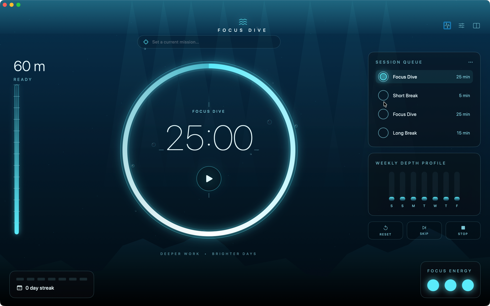

# Focus Dive

A native macOS focus timer that turns Pomodoro-style sessions into a calm ascent from 60 meters below the surface.



## Features

- Focus, short-break, and long-break sessions with configurable durations
- Start, pause, reset, stop, and skip controls
- Mission field for naming the current focus session
- Animated depth gauge and progress ring with Reduce Motion support
- Four-session queue: focus, short break, focus, long break
- Local dive log, seven-day activity profile, and streak indicator
- Collectible ocean discoveries after every third completed focus session
- Compact timer and menu-bar controls
- Local completion notifications
- Silent MVP; ambience and completion-sound controls are reserved for a later release

## Requirements

- macOS 14 or later
- Xcode 16 or a Swift 6 toolchain

## Run with Swift Package Manager

```bash
git clone <repository-url>
cd FocusDive
swift run FocusDive
```

Build and test the package without launching the app:

```bash
swift build
swift test
```

## Build the macOS app bundle

```bash
./scripts/build-app.sh release
open "dist/Focus Dive.app"
```

The script builds the executable, assembles `dist/Focus Dive.app`, copies `Resources/Info.plist`, and applies an ad-hoc signature. Pass `debug` instead of `release` for a debug bundle.

## Architecture

```text
FocusDive
├── Sources/FocusDiveCore       Timer, session sequencing, settings, persistence
├── Sources/FocusDiveApp        SwiftUI app, view model, dashboard, components
├── Tests/FocusDiveCoreTests    Swift Testing unit tests
├── UITests/FocusDiveUITests    XCTest UI smoke test
├── Resources                   App metadata
└── scripts                     App-bundle build tooling
```

`FocusDiveCore` is UI-independent. `DiveTimer` owns deterministic timer state, `SessionCoordinator` advances focus and break sessions, and `JSONDiveStore` persists settings and completed dives. `FocusDiveViewModel` adapts the core for SwiftUI, drives the quarter-second UI ticker, sends notifications, and exposes dashboard state.

## Keyboard shortcuts

| Action | Shortcut |
| --- | --- |
| Start or pause from the dashboard | `Space` |
| Start or pause from the app menu | `Command-Space` |
| Reset | `Command-R` |
| Skip session | `Command-Option-Right Arrow` |
| Open settings | `Command-,` |
| Open dive log | `Command-L` |
| Toggle compact timer | `Command-Shift-M` |

`Command-Space` may be reserved by Spotlight depending on macOS settings.

## Testing

Run the core test suite:

```bash
swift test
```

Run the app and UI tests through the generated Xcode project:

```bash
brew install xcodegen
xcodegen generate
xcodebuild test \
  -project FocusDive.xcodeproj \
  -scheme FocusDive \
  -destination 'platform=macOS' \
  CODE_SIGNING_ALLOWED=NO
```

The generated `FocusDive.xcodeproj` is ignored by Git. Unit tests cover timer transitions, completion, depth, duration validation, session advancement, and JSON round trips. The UI smoke test covers start, pause, and reset.

## Privacy

Focus Dive has no accounts, analytics, advertising, or network service. Settings and completed focus sessions are stored locally at:

```text
~/Library/Application Support/FocusDive/focus-dive.json
```

The app requests notification permission only to show a local completion banner. Delete the JSON file to remove saved settings and dive history. Uninstalling the app does not automatically remove that Application Support file.

## Project notes

Product, design, engineering, and release notes live in the Obsidian-compatible vault at [`Notes/Focus Dive`](Notes/Focus%20Dive/Index.md).
